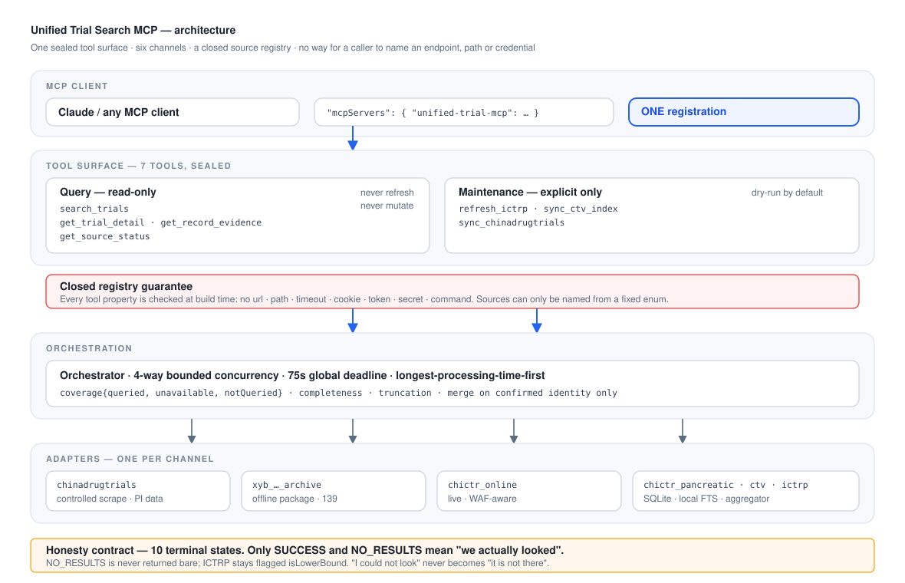
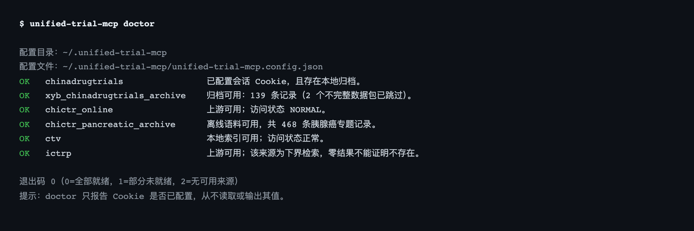

# 统一临床试验检索 MCP 服务

[](./README.zh-CN.md)
[](./README.md)
[](https://github.com/opencare-skillhub/unified-trial-search-mcp-service/actions/workflows/ci.yml)
[](#许可证)
[](https://nodejs.org/)
[](https://www.typescriptlang.org/)
[](https://modelcontextprotocol.io/)
[](#测试)
[](#六个数据通道)
[](#七个-mcp-工具)

**一个 MCP 入口，同时检索六个临床试验通道 —— 并且绝不对"没查到"的事撒谎。**

> 💚 本项目由 **小胰宝（XiaoYiBao）社区** 贡献者 **Sam** 的用心付出促成，在此致谢。



`doctor` 如实报告每个通道的状态 —— 且从不打印 Cookie：



---

## 为什么需要它

检索过临床试验的人都熟悉这个流程：五个浏览器标签页、四个不同的注册库搜索框、三种不同的登记号格式，
而且**无法判断"0 条结果"到底意味着*试验不存在*，还是*索引根本没覆盖到***。

现有的临床试验 MCP 服务都是"一个注册库一个服务"。但这恰恰与人们真正要问的问题不匹配 ——
*"我这个患者，全世界有没有可参加的试验？"* —— 因为只有当你能证明"我确实都查过了"、
并诚实说明"哪些地方我没查到"时，这个答案才有意义。

**本服务把六个通道收敛到一个封闭的工具面之后**，围绕一条不容妥协的原则构建：

> **绝不把"我没能查"悄悄变成"它不存在"。**

这一条原则，几乎决定了下面所有的设计取舍。

## 独特价值

| | 常见的单库 MCP | **本服务** |
|---|---|---|
| 通道数 | 1 | **6**（在线 + 离线语料） |
| 跨源去重 | ✗ | ✅ 仅在**确认同一登记身份**时合并 |
| "0 条结果" | 直接返回 | ✅ **绝不**单独返回，必带该来源自身的覆盖声明 |
| 失败报告 | 笼统报错 | ✅ **10 个机器可读终态** |
| 部分覆盖 | 不可见 | ✅ `coverage` + `completeness` + 截断标记 |
| 调用方指定 URL／超时 | 常见 | ✅ **结构上不可能**（封闭注册表） |
| 配置中的秘密 | 常有 | ✅ 独立 `cookie.env`，权限 0600，永不打印 |
| 新环境部署 | 手工部署 5 个服务 | ✅ **只注册一个** + `doctor` + 引导式 `bootstrap` |

### 一句话概括

**这是目前 GitHub 上覆盖最完整的临床试验 MCP 服务** —— 全球注册库、中国注册库、CDE 药物临床试验
登记平台三条主线全部打通，并且独家提供 **NMPA／ChinaDrugTrials 的研究者（PI）信息**，
这是其他任何临床试验 MCP 都拿不到的数据。

## 六个数据通道

| 来源 ID | 通道 | 类型 | 擅长什么 |
|---|---|---|---|
| `ictrp` | WHO ICTRP | 在线聚合 | 全球广度，天然多注册库 |
| `ctv` | Veeva CTV | 在线 + 本地 FTS | ClinicalTrials.gov 深度，本地索引快 |
| `chictr_online` | ChiCTR | 在线 | 中国注册试验，实时 |
| `chictr_pancreatic_archive` | ChiCTR 离线语料 | 离线 SQLite | 468 条胰腺癌记录 + 原始 HTML |
| `chinadrugtrials` | ChinaDrugTrials | 受控抓取 | **含研究者（PI）信息** |
| `xyb_chinadrugtrials_archive` | 小胰宝归档 | 离线数据包 | 139 条胰腺癌记录，结构化章节 |

### 经得起核验的跨源身份合并

检索会并发扇出，然后合并结果 —— 但**只在确认登记身份一致时才合并**：

```
ctv:UTN000552084  ┐
                  ├─►  NCT:NCT07066098   （同一试验，两个视角）
ictrp:NCT07066098 ┘
```

**标题完全相同但登记号不同的两条记录，永远不会被合并。** 已在真实数据上验证：
15 条原始命中 → 13 条规范记录，2 处合并均经人工核验。每条合并记录都保留
`mergedFrom`、`sourceLabels` 与 `perSource`，合并过程始终可审计。

## 诚实性契约

十个终态，其中**只有两个**意味着"我们确实查过了"：

| 状态 | 含义 |
|---|---|
| `SUCCESS` | 已查询，返回结果 |
| `NO_RESULTS` | 已查询，确实为空 —— **且带该来源自身的说明** |
| `NOT_ENABLED` | 来源已关闭 |
| `NEEDS_SETUP` | 缺依赖、路径、运行时或会话 |
| `NOT_QUERIED` | 从未尝试（总时限已到） |
| `TIMEOUT` | 已启动，未在时限内完成 |
| `CHALLENGE_REQUIRED` | 需要人工验证 —— **绝不绕过** |
| `RATE_LIMITED` | 上游限流 |
| `DENIED` | 来源拒绝访问 |
| `FAILED` | 已尝试但出错 |

`NO_RESULTS` 永远不会单独返回。本地索引未命中会明说：

> *"仅表示本地 SQLite/FTS 索引未命中，不代表 ClinicalTrials.gov 上不存在该试验。"*

而 ICTRP —— 存在已知静默缺口 —— 被永久标记 `isLowerBound: true`：

> *"上游标注结果不完整，估计缺失 N 条；ICTRP 导出存在已知静默缺口，零/少结果不能作为'不存在'的结论。"*

## 七个 MCP 工具

**查询类（只读 —— 绝不联网刷新、绝不修改索引）：**

| 工具 | 必填 | 用途 |
|---|---|---|
| `search_trials` | `keyword`/`keywords`/`condition`/`terms` 至少一个 | 有界并发扇出；返回来源级终态、覆盖与完整性 |
| `get_trial_detail` | `recordId` | 单条详情；`recordId` 形如 `<sourceId>:<sourceRecordId>` |
| `get_record_evidence` | `recordId` | 原始证据：`raw_html`/`source_json`/`source_word`/`raw_text`/`field_excerpt` |
| `get_source_status` | — | 逐来源就绪状态、新鲜度与诊断 |

**维护类（必须显式调用，默认 dry-run）：**

| 工具 | 用途 |
|---|---|
| `refresh_ictrp` | 刷新 ICTRP 缓存／快照 |
| `sync_ctv_index` | 重建 CTV 本地索引 |
| `sync_chinadrugtrials` | 增量归档 ChinaDrugTrials |

### 封闭注册表保证

`search_trials` **只接受已注册的来源 ID**。没有任何工具接受 URL、上游工具名、自定义超时、
文件系统路径、Cookie 或秘密。调用方**无法把这个服务指向任意端点** —— 这由 schema 强制，
并有测试逐一扫描每个工具的属性名，确保不含 `url`/`path`/`timeout`/`cookie`/`token`/`secret`/
`credential`/`command`/`tool` 等禁止字段。

## 安装

需要 **Node ≥ 20**。离线语料路径不需要 Python。

```bash
git clone https://github.com/opencare-skillhub/unified-trial-search-mcp-service.git
cd unified-trial-search-mcp-service
npm install
npm run build
```

### 注册到 MCP 客户端

```json
{
  "mcpServers": {
    "unified-trial-mcp": {
      "command": "node",
      "args": ["/绝对路径/unified-trial-search-mcp-service/dist/src/cli/main.js", "serve"],
      "env": { "UNIFIED_TRIAL_CONFIG_DIR": "/绝对路径/.unified-trial-mcp" }
    }
  }
}
```

**只注册这一个。整合工作到此结束。** 其余通道由本服务自己去对接。

### 五分钟上手

```bash
# 1) 诊断：逐来源报告运行时、依赖、数据路径、新鲜度与会话
node dist/src/cli/main.js doctor

# 2) 挂载本地资产（写入 <configDir>/unified-trial-mcp.config.json，权限 0600）
node dist/src/cli/main.js configure \
  --chictr-corpus     /绝对路径/chictr_pancreatic.db \
  --xyb-archive       /绝对路径/xyb-chinadrugtrials-data/output \
  --ictrp-bundle      /绝对路径/ictrp-mcp-service \
  --ctv-mcp-server    /绝对路径/ctv-mcp-server \
  --chictr-mcp-server /绝对路径/chictr_trials

# 3) 显式初始化（默认 dry-run，只打印计划）
node dist/src/cli/main.js bootstrap
node dist/src/cli/main.js bootstrap --apply

# 4) 取得 ChinaDrugTrials 会话（全自动；失败会引导人工兜底）
node dist/src/cli/main.js configure --cookie-from-entry-page

# 5) 再次诊断
node dist/src/cli/main.js doctor
```

`doctor` 退出码：`0` 全部就绪 · `1` 降级但可用 · `2` 没有可用来源。

若任何环节缺失，`doctor` 与 `bootstrap` 会打印**可直接复制的下一条命令**，绝不只给一句"未就绪"。

## 配置

| 优先级 | 机制 |
|---|---|
| 1（最高） | CLI 参数 |
| 2 | 环境变量 |
| 3 | 配置文件 |
| 4 | 默认值 |

配置目录下有两个文件，职责刻意分离：

| 文件 | 内容 | 权限 |
|---|---|---|
| `unified-trial-mcp.config.json` | 只含路径 —— **永不含秘密**，可安全复制或提交 | `0600` |
| `cookie.env` | 会话 Cookie，由 `configure` 写入 | `0600` |

真实环境变量**优先于** `cookie.env`，因此显式 `export` 总能覆盖。缺失 `cookie.env` 视为
"未配置"，绝不凭空产生凭证。

### 关于 ChinaDrugTrials 会话

新环境**无需人工翻阅浏览器**即可取得：

```bash
unified-trial-mcp configure --cookie-from-entry-page
```

它发起**一次站点公开入口页的普通 GET**，取回站点主动下发的两个匿名反爬票据
（`FSSBBIl1UgzbN7N80S` / `...T`），然后用**一次真实只读检索来实测校验**，通过后才保存。
若站点需要登录态，人工兜底方式为：

```bash
unified-trial-mcp configure --cookie-from-curl '<浏览器「复制为 cURL」的命令>'
```

**这不是绕过 WAF，而且这个区分至关重要。** 这些票据是站点在正常访问时就*主动给我们*的：
没有解验证码、没有破挑战、没有规避限流、没有伪造凭证。这与"击败访问控制"有本质区别，
后者本服务永不做。`doctor` 与 `bootstrap` **绝不**自行获取 Cookie，只打印命令并说明失败原因。
服务也不读取其他项目的配置文件或浏览器 Profile。

## 安全边界

- 不绕过 Cookie、访问控制、robots、WAF、验证码或其他反自动化机制。
- 不自动获取秘密或受控数据；只有显式命令才会触发。
- 永不打印 Cookie 值（仅打印字段名与长度指纹）。
- 所有日志与错误路径均做秘密字段剔除。
- 证据路径限定在已配置根目录的 allowlist 之内。
- 不把"没查到"变成"不存在" —— 见上文诚实性契约。

## 项目结构

```
src/
  core/         类型、注册表、配置、编排器、合并器、规范化、日志、MCP 传输
  adapters/     每通道一个：ictrp、ctv、chictr-online、chictr-pancreatic、
                chinadrugtrials、xyb-archive
  tools/        7 个 MCP 工具：schemas、handlers、server
  cli/          单一入口：serve / doctor / bootstrap / configure；Cookie 获取
test/           46 个测试：单元、适配器、编排器、工具
scripts/        CI 守卫（封闭注册表不变量）
docs/           运维手册、测试报告、图表资源
.github/        CI 工作流：类型检查、构建、3 轮测试、不变量守卫
```

## 测试

```bash
npm test
```

```
# tests 46
# pass 46
# fail 0
```

其中一个测试是"可选启用"的：它需要真实的 ChiCTR 语料快照（CI 不提供该数据）。未提供时结果
为 `45 通过 / 1 跳过`；如需对本地语料实测：

```bash
UNIFIED_TRIAL_TEST_CHICTR_CORPUS=/path/to/chictr_pancreatic.db npm test
```

覆盖范围：记录身份与规范化、仅在确认身份时合并、适配器对真实数据的契约、
4 并发／75 秒总时限编排器（含"从未启动"与"已超时"的区分）、全部 7 个工具的 schema 与
错误契约、Cookie 获取与掩码、挑战页识别。

已对真实来源完成端到端验证：六通道全量 `search_trials`、跨源合并、详情与证据检索、
维护工具 dry-run，以及**在零环境变量下**走通完整的新环境 Cookie 流程。

### 持续集成

[`.github/workflows/ci.yml`](.github/workflows/ci.yml) 在每次 push 与 PR 上运行，矩阵覆盖
**Node 20 与 22** × **Ubuntu 与 macOS**：类型检查 → 构建 → **连跑 3 轮测试**（本项目含
时限与并发敏感路径，单轮通过证据不足）→ CLI 冒烟 → 两道不变量守卫：

- **无凭证入库** —— 一旦 `cookie.env` 或配置文件被纳入版本控制即失败。
- **封闭注册表** —— [`scripts/check-closed-registry.mjs`](scripts/check-closed-registry.mjs)
  在测试进程之外重新校验构建产物的 schema，任何工具属性一旦允许调用方指定端点、路径、
  超时或凭证，即判定构建失败。

## 已知数据注意事项

公开记录而非隐藏 —— 详见 [`docs/operations.md`](./docs/operations.md)：

- 小胰宝归档 `summary.json` 的 `scrape_time` 与单条记录冲突。
- ChinaDrugTrials 扁平 `details` 不可信（`申请人名称 = "12"`）；嵌套 `sections` 才是权威。
- 31 条历史 ChiCTR 记录 `registration_number = NULL` —— `project_id` 才是真实身份。
- ICTRP 存在已知静默缺口，因此少量结果不能证明不存在。

## 许可证

MIT，详见 [LICENSE](./LICENSE)。

> ⚠️ 公开来源资料可能包含个人信息。返回数据如实反映其来源；请遵守各注册库的服务条款与适用法律，
> 不要将"公开可访问"理解为"可无限制再分发"。切勿提交 `cookie.env`。

---

## 致谢 / Acknowledgements

本项目由 **小胰宝（XiaoYiBao）社区** 贡献者 **Sam** 的 ❤️ 付出促成 —— 感谢他的用心与坚持。

This project was made possible by the ❤️ care and hard work of **Sam**, contributor to the
**小胰宝 (XiaoYiBao) community**. Thank you.
